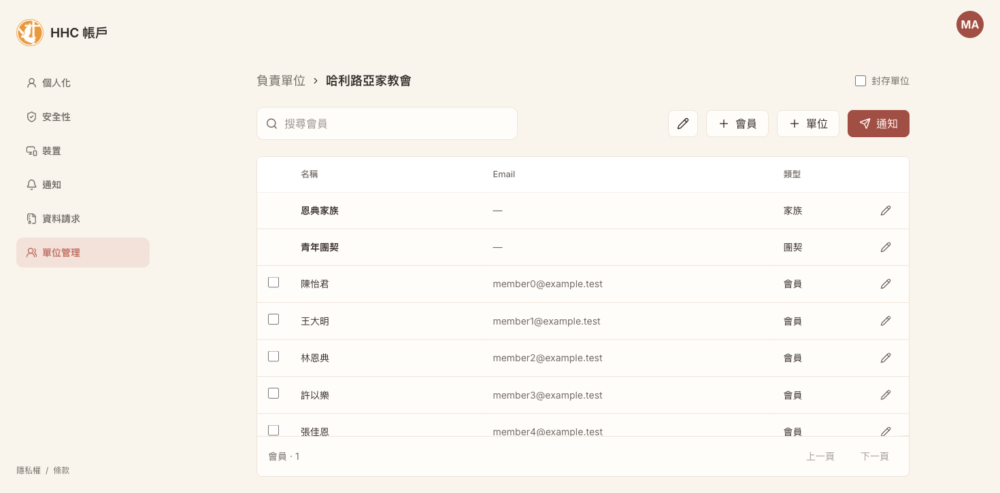
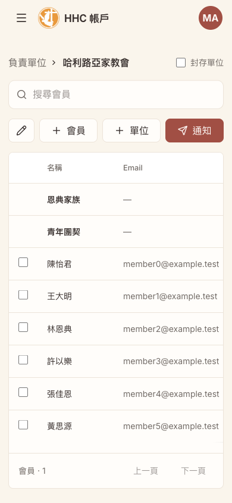
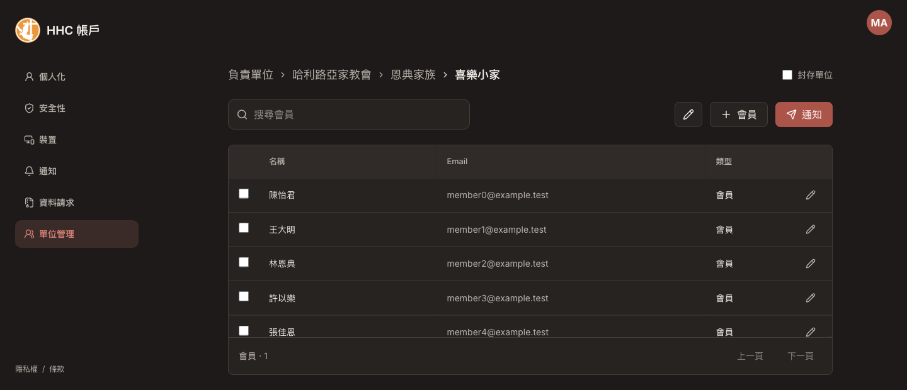
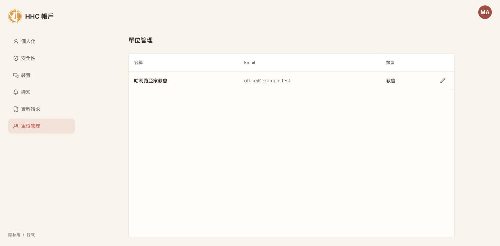
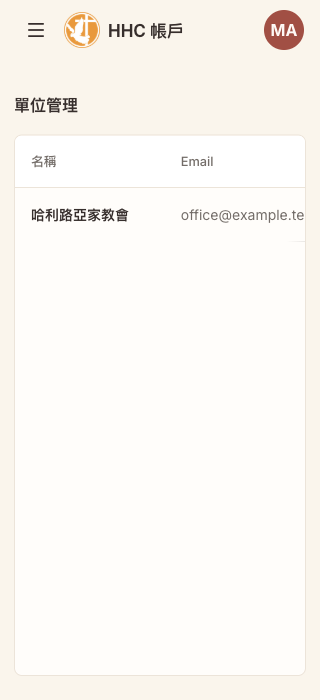
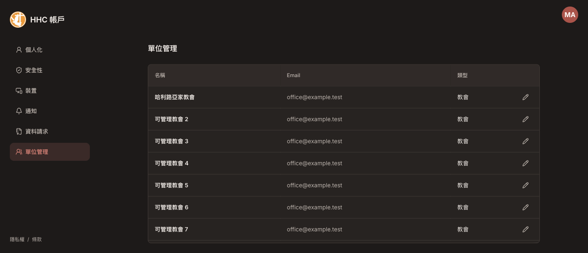

# Account unit layout and caught API errors

Reviewed 2026-09-26. Base: `117ce801dcfaced35605a1cfe561740dd651009d` (`origin/main`).
Implementation/PR only; merge and production release require approval.

## Scope and architecture

- Reuse shared `DataTableFrame`, Admin-style Pencil/Plus actions, and existing Account tokens. No new dependency, service, permission model, backend contract or migration.
- Enlarged breadcrumb + archive filter; search + compact actions; icon-free directory names; rightmost unit/member links; viewport-sized scrolling table with 280px minimum.
- Child creation requires both church/family kind and server action. Membership lookup/admission, church isolation, recipient deduplication and entitlement semantics are unchanged.
- One access lookup supplies navigation and the three organization route gates. Failed lookup is retryable, not denial; the backend remains the authorization boundary.
- Observability is at client request boundaries, not page catches or a global fetch patch. Operations uses generated-client middleware and stable schema paths; Account and notifications use a scoped fetch wrapper. Existing session/notification validators are reused; Operations validates directory/resource/access shapes used by these views before rendering.
- Network/5xx/invalid success responses report safe synthetic exceptions. Intentional aborts and expected 4xx do not. SDK loading/capture failure must not alter requests. A pending SDK import retains the first event.
- Capture Account's rejected token before awaiting the response: logout winning an in-flight 401 must not restore a late refresh token. The existing regression test caught this race when the wrapper introduced an async boundary.

## Automated verification

All passed locally: 388 tests (44 files), `pnpm lint`, `pnpm build`, `scripts/test-release-policy.sh`, `az bicep build --file infra/main.bicep --stdout`, `git diff --check`.
Build retains the existing >500kB bundle warning; no dependency changes.

| Scenario | Verification |
| --- | --- |
| Ordinary member / direct URLs / lookup failure + retry | App route tests; ordinary-member browser redirect with zero organization links |
| Church/family vs small group/fellowship; action denied | Component tests |
| Last-column destinations and icon-free names | Component tests and browser member navigation |
| Network, 500/502/503, invalid JSON | Real client instances with mock transport; one captured event, original rejection preserved |
| 400/401/403/404/409/422/429, Abort | No captured exception |
| 401 refresh then success / 503 | Two transport attempts; zero / one captured event |
| Malformed resources / session response | Rejected and reported before rendering |
| Notification capture failure | One write request only, no telemetry-induced retry |
| Lazy SDK / unavailable SDK / no DSN | Initialization tests |
| Direct session runtime / refresh failure propagated to Operations | Shared runtime hook + observed transport, one event across both clients |
| Privacy | No original errors, body, headers, user, breadcrumbs or query values in caught-event payload |

## Browser verification

Local development-only fixture (`review-organizations.html`), no real membership or notification mutations:

- Desktop, 390px, 320px, nested breadcrumb, dark theme, member detail and notification dialog.
- At 320px and 390px, document width equals viewport width; the table itself can scroll horizontally.
- At 1440x620 with 50 rows, page height 620px; inner table viewport 305px / content 2777px, scrolled to bottom. Footer remains outside the scrolling body.
- Batch controls appear on selection; unmatched search gives the empty state. Small group hides child creation.
- Fault injection `?failure=members`: one local 503, error UI, retry restores eight rows. `?rows=50` provides the long-table case; `?persona=member` verifies denial.
- Fixture writes are in-memory and reset on reload; created unit URLs are not persistent. This is a UI fixture, not backend acceptance.

## Real Sentry reception

[ACCOUNT-FE-5](https://halleluya-community-caring-ass.sentry.io/issues/7756353736/) received the controlled local 503 in **review**, release `account-unit-review-20260926`.
First event: `bdd4b29b13b9419ab80ff9fa04d98146`.
Final-message event: `7438b4fa69564ed99ae9a6be7ae10eec`; verified normal stack frames without the earlier spurious `/members` frame.

- `operation=/api/operations/manage/org-units/{unitId}/members`, `method=GET`, `status=503`, `request_id=review-account-unit-20260926`.
- One event for the first injected failure; successful user retry did not report a second failure. A second controlled run verifies the final synthetic message (which omits the path to avoid a spurious parsed stack frame).
- Authenticated Sentry event JSON confirmed no request, breadcrumbs, extra, member data or token. Sentry adds geographic context server-side; no account identity was submitted.
- Stack contains `reportApiFailure`, Operations middleware, unwrap, and `OrganizationUnitPage`. This is a development-stack check, **not** proof of production minified source-map resolution.

## Explicit remaining gates

- PR CI, approval, merge/release and authenticated production smoke are separate from local verification.
- Production release must upload source maps via the existing fail-closed workflow and verify the deployed release identifier.
- No Azure error was induced: the fixture request ID is local, so there is no matching Azure server log. Real backend request-ID correlation remains a release/incident check.
- Shared runtime shape errors use the existing package event metadata. That hook does not always expose request ID or distinguish CSRF GET from token POST decoding; unknown method is explicitly `UNKNOWN`, not fabricated. Network/HTTP failures still have transport-level metadata. Improving that validation metadata belongs to the shared package, not duplicated session parsing here.
- The user's original intermittent loading failure remains **open / root cause unconfirmed**. Filling the reporting gap is not proof that the original failure is fixed.

## Root directory follow-up (2026-09-26)

The earlier layout change omitted `OrganizationRootsPage`. This follow-up replaces its cards with the same DataTableFrame, row styles and last-column Pencil link used by unit folders. The visible breadcrumb and all descendant root links use the existing localized Unit management title; the duplicate description is removed. No archive/member controls are added to this unit-selection level.

The backend `/manage/roots` remains responsible for ancestor deduplication. The frontend renders its response as-is, including manageable units whose parents are outside the actor's scope. No API, authorization or telemetry changes.

Verification: **391 tests passed**, lint/build/release-policy/Bicep validation passed. Tests cover icon-free names, last-column links, multiple server-selected roots, empty/error/retry states and the complete root → unit → member → root route journey.

Browser verification used only local fixtures: the full journey and renamed breadcrumbs, empty roots, keyboard focus, desktop and 320px layouts. At 320px document width remains 320px. With 50 roots at 1440x620, page height remains 620px and table body scrolls (436px viewport / 2752px content). Dark theme inspected. Use `?roots=50#/organizations` or `?roots=empty#/organizations` with the review fixture.

This follow-up requires its own PR/CI and release approval; these checks are not production acceptance.

